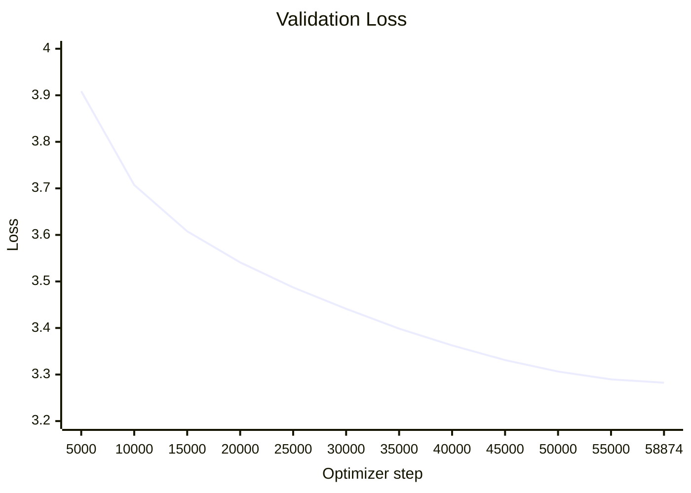

# CGPT

A small GPT-style language model written in C++20 and CUDA. The project contains the model implementation, CUDA kernels, training and generation tools, and tests.

This README also records the results of one training run of the 104M-parameter model.

## Training run

The `104m` model was trained for one epoch on approximately 10 GB of `FineWeb-Edu` data. The run finished after **58,874 optimizer steps**.

Final losses were:

- training: **3.302037**
- validation: **3.282484**

The model and checkpoints are in `output/model-104m`.

## Table of contents

- [Training run](#training-run)
- [Quick start](#quick-start)
  - [Configure and build (Windows / PowerShell)](#configure-and-build-windows--powershell)
  - [Tests](#tests)
  - [Text generation](#text-generation)
  - [Training](#training)
  - [API documentation](#api-documentation)
- [Experiment configuration](#experiment-configuration)
- [Data preparation](#data-preparation)
- [Comparison with GPT-2](#comparison-with-gpt-2)
- [Generation result](#generation-result)
- [Notes](#notes)
- [Artifacts](#artifacts)

## Quick start

The project builds a CUDA core library, the `cgpt_train` training executable, the `cgpt_cli` text-generation interface, and a unit-test suite. The main requirements are:

- CMake `4.3` or newer;
- a C++20 compiler with CUDA support;
- the CUDA Toolkit with `cudart`, `cuBLASLt`, and CUPTI;
- a compatible NVIDIA GPU (CUDA architectures `86` and `90a` are compiled by default).

### Configure and build (Windows / PowerShell)

```powershell
cmake -S . -B build -G "Visual Studio 17 2022" -A x64
cmake --build build --config Release --parallel
```

If you are using an existing build directory, run:

```powershell
cmake --build build --config Release --parallel
```

### Tests

```powershell
ctest --test-dir build -C Release --output-on-failure
```

Alternatively, use the aggregate CMake target:

```powershell
cmake --build build --config Release --target run_all
```

To run a single test:

```powershell
ctest --test-dir build -C Release -R rmsnorm_test --output-on-failure
```

### Text generation

After building, start the CLI without a prompt to enter REPL mode:

```powershell
.\build\Release\cgpt_cli.exe
```

To generate text from a single prompt:

```powershell
.\build\Release\cgpt_cli.exe `
  --model .\build\Release\outputdg\step-58874 `
  --prompt "The future of local AI is" `
  --max-new-tokens 128 `
  --temperature 0.8 `
  --device cuda
```

To display CLI help and use common generation parameters:

```powershell
.\build\Release\cgpt_cli.exe --help
.\build\Release\cgpt_cli.exe --prompt "Hello" --top-k 40 --top-p 0.95 --seed 42
```

The REPL supports `/help`, `/params`, `/set <parameter> <value>`, and `/exit`.

### Training

Example training command using the configuration described in this report:

```powershell
.\build\Release\cgpt_train.exe `
  --input data\fineweb_edu_10gb.jsonl `
  --tokenizer data\fineweb_edu_tokenizer_32k.json `
  --output-dir output\model-104m `
  --model 104m `
  --vocab-size 32000 `
  --batch-size 32 `
  --sequence-length 1024 `
  --epochs 1 `
  --learning-rate 3e-4 `
  --min-learning-rate 3e-5 `
  --validation-fraction 0.1 `
  --validation-interval 5000 `
  --validation-batches 64 `
  --save-avg-loss
```

### API documentation

The project includes a `Doxyfile` for generating HTML and LaTeX documentation from the source code and public headers. From the project root, run:

```powershell
doxygen Doxyfile
```

The generated documentation is written to the `html` and `latex` directories. To open the HTML documentation locally on Windows:

```powershell
Start-Process .\html\index.html
```

Useful helper scripts:

```powershell
python scripts\download_100mb.py
python scripts\download_fineweb_edu.py
.\scripts\profile_kernels.ps1
```

Data and model paths may need to be adjusted for the selected CMake generator.

## Experiment configuration

| Parameter | Value |
|---|---:|
| Model | `104m` |
| Input data | `data/fineweb_edu_10gb.jsonl` |
| Tokenizer | `data/fineweb_edu_tokenizer_32k.json` |
| Vocabulary size | 32,000 tokens |
| Batch size | 32 |
| Sequence length | 1,024 tokens |
| Epochs | 1 |
| Learning rate | `3e-4` |
| Minimum learning rate | `3e-5` |
| Warmup steps | 0 |
| Loss scale | 1024 |
| Validation fraction | 10% |
| Validation interval | Every 5,000 steps |
| Validation batches | 64 |

The training run was started with:

```bash
./build/cgpt_train \
  --input data/fineweb_edu_10gb.jsonl \
  --tokenizer data/fineweb_edu_tokenizer_32k.json \
  --output-dir output/model-104m \
  --model 104m \
  --vocab-size 32000 \
  --batch-size 32 \
  --sequence-length 1024 \
  --epochs 1 \
  --learning-rate 3e-4 \
  --min-learning-rate 3e-5 \
  --warmup-steps 0 \
  --loss-scale 1024 \
  --validation-fraction 0.1 \
  --validation-interval 5000 \
  --validation-batches 64 \
  --save-avg-loss
```

## Data preparation

The BPE tokenizer was trained on 1,024 MiB of data. This took **227.26 s** at an average speed of **139.66 iterations/s**.

The complete input file was then tokenized:

- processed data size: **9,843,688,080 bytes**;
- tokenization time: **22.62 s**;
- throughput: **414.98 MiB/s**;
- generated tokens: **2,143,562,534**.

## Training progress

| Step | Training loss | Validation loss |
|---:|---:|---:|
| 5,000 | 3.910492 | 3.908841 |
| 10,000 | 3.702029 | 3.707374 |
| 15,000 | 3.562318 | 3.607797 |
| 20,000 | 3.399266 | 3.540929 |
| 25,000 | 3.500671 | 3.487137 |
| 30,000 | 3.451362 | 3.441219 |
| 35,000 | 3.431984 | 3.398644 |
| 40,000 | 3.370052 | 3.362667 |
| 45,000 | 3.197763 | 3.331056 |
| 50,000 | 3.220727 | 3.306455 |
| 55,000 | 3.411847 | 3.289633 |
| 58,874 | 3.302037 | 3.282484 |

### Validation loss chart



Validation checkpoints were saved at steps `5000`, `10000`, `15000`, `20000`, `25000`, `30000`, `35000`, `40000`, `45000`, `50000`, `55000`, and `58874`.

The run took approximately **12,741.46 s** (3 hours 32 minutes), at about **4.62 steps/s**.

## Comparison with GPT-2

GPT-2 Small is a useful rough reference: it has approximately **124M parameters**, compared with **104M** here. The datasets, tokenizers, hardware, and training setups are different, so this is only a scale comparison. GPT-2 used WebText and a 50,257-token vocabulary; this run used FineWeb-Edu and a 32,000-token BPE vocabulary. See the [original GPT-2 paper](https://cdn.openai.com/better-language-models/language-models.pdf) and the [OpenAI GPT-2 model card](https://github.com/openai/gpt-2/blob/master/model_card.md).

| Metric | This project | Original GPT-2 reference |
|---|---:|---:|
| Model size | 104M parameters | 124M parameters (GPT-2 Small) |
| Training data | FineWeb-Edu, ~10 GB | WebText, 40 GB |
| Vocabulary | 32,000 tokens | 50,257 tokens |
| Training duration | **3 h 32 min** | Approximately **7 days** for the historical full GPT-2 training run* |
| Training cost | **$25** | Approximately **$43,000** for the historical full run* |

\* The historical GPT-2 time and cost figures refer to the full original training run, not exclusively to the 124M GPT-2 Small checkpoint. They are therefore useful as a scale comparison, but are not a controlled benchmark: the runs used different hardware, software, datasets, model sizes, and training budgets. Based on these figures, this project completed in roughly **48× less wall-clock time** and at roughly **1,720× lower estimated cost**.

The cost difference mostly comes from the smaller model, one training epoch, and the local hardware. It is not an equivalent reproduction of the original GPT-2 training run.

## Generation result

One short generation was:

> The question is whether the water in the ocean is actually fresh. In this case the question is whether the sea is actually fresh.

The model generated at approximately **150 tokens/s** on an **NVIDIA RTX 3050 Laptop GPU with 4 GB VRAM**.

The output is sometimes grammatical, but it is also short and repetitive, which is not surprising for a 104M-parameter model trained for one epoch.

### Additional generation output

```text
The cat has jumped at normal height, much as it took a ball of speed to pass the ball, and the cat has for a long time, very barely like a ball, less than a half inch in diameter and much less than half a centimeter at any one time.
The death of the cat has been caused by several factors, including albinism, a lack of diet, and a poor diet. While cats are generally calm and comfortable, albinism can also cause a cat to grow and be weak. Even healthy individuals are not at risk, and a cat can be raised only in a certain area of the clan, so a cat with alb
[generated 128 tokens in 0.81 s | 157.16 tok/s]
```

This sample contains **128 generated tokens** and took **0.81 s** (**157.16 tokens/s**). It is readable in places, but repetitive and semantically unstable.

> **Note:** This is a next-token prediction model. It does not fact-check or verify what it generates, so the output should not be treated as reliable information.

## Notes

The run completed without errors, and the model was also exported in Hugging Face format. Validation loss fell from `3.908841` at step 5,000 to `3.282484` at the end. The final validation loss was slightly below the final training loss, although this single run is not enough to draw strong conclusions about generalization.

The lowest recorded training loss was `3.197763` at step 45,000. More training, a warmup schedule, different learning-rate settings, and a larger evaluation set would be reasonable next experiments.

## Artifacts

- final model: `output/model-104m`;
- checkpoints: `output/model-104m/checkpoints/`;
- tokenizer: `data/fineweb_edu_tokenizer_32k.json`;
- full training log: `training_output.txt`.
